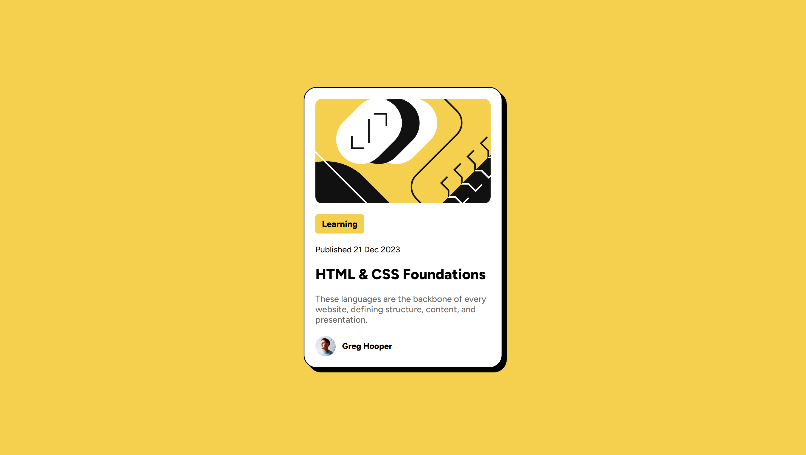

# Frontend Mentor - Blog preview card solution

This is a solution to the [Blog preview card challenge on Frontend Mentor](https://www.frontendmentor.io/challenges/blog-preview-card-ckPaj01IcS).

## Table of contents

- [Overview](#overview)
  - [The challenge](#the-challenge)
  - [Screenshot](#screenshot)
  - [Links](#links)
- [My process](#my-process)
  - [Built with](#built-with)
  - [What I learned](#what-i-learned)
  - [Useful resources](#useful-resources)
- [Author](#author)

## Overview

### The challenge

Users should be able to:

- See hover and focus states for all interactive elements on the page

### Screenshot



### Links

- Solution URL: [Click Me](https://www.frontendmentor.io/solutions/blog-preview-card-Jq-wmzysA1)
- Live Site URL: [Click Me](https://suchit-shah.github.io/frontend-mentor/newbie-level/blog-preview-card/)

## My process

### Built with

- Semantic HTML5 markup
- CSS
- Flexbox

### What I learned

I learnt about pseudo elements, which can have different properties when we interact with them

```css
.title:hover{
    color: hsl(47, 88%, 63%);
    cursor: pointer;
}
```

### Useful resources

- [MDN](https://developer.mozilla.org/en-US/) - This helped me for implementing pseudo elements and their properties.

## Author

- Frontend Mentor - [@Suchit-Shah](https://www.frontendmentor.io/profile/Suchit-Shah)