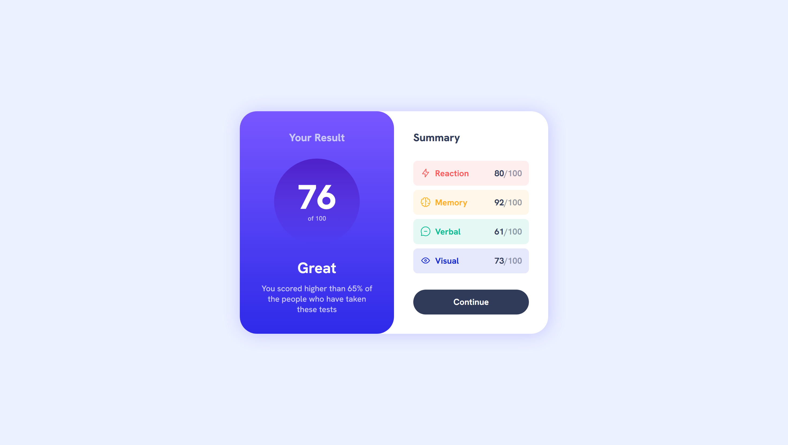
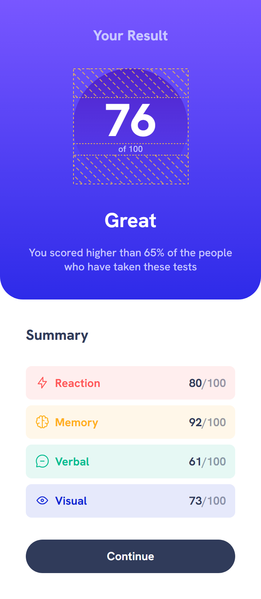

# Frontend Mentor - Results summary component solution

This is a solution to the [Results summary component challenge on Frontend Mentor](https://www.frontendmentor.io/challenges/results-summary-component-CE_K6s0maV).

## Table of contents

- [Overview](#overview)
  - [The challenge](#the-challenge)
  - [Screenshot](#screenshot)
  - [Links](#links)
- [My process](#my-process)
  - [Built with](#built-with)
  - [What I learned](#what-i-learned)
  - [Useful resources](#useful-resources)
- [Author](#author)

## Overview

### The challenge

Users should be able to:

- View the optimal layout for the interface depending on their device's screen size
- See hover and focus states for all interactive elements on the page

### Screenshot





### Links

- Solution URL: [Click Me](https://www.frontendmentor.io/solutions/results-summary-component-np5-Lm4-W_)
- Live Site URL: [Click Me](https://suchit-shah.github.io/frontend-mentor/Results-summary-component/)

## My process

### Built with

- Semantic HTML5 markup
- CSS
- Flexbox

### What I learned

I learnt about gradients, flex : wrap and media queries

```css
.left{
    background: linear-gradient(hsl(252, 100%, 67%), hsl(241, 81%, 54%));
    color: hsl(241, 100%, 89%);
    text-align: center;
}
```
```css
.card{
    display: flex;
    flex-wrap: wrap;
    justify-content: center;
    align-items: center;

    background-color: white;
    border-radius: 2rem;
    box-shadow: 0.1rem 0.1rem 2rem hsl(241, 100%, 89%);
}
```
```css
@media (max-width: 30rem){
    .left{
        border-radius: 0 0 2rem 2rem;
    }
    .card{
        border-radius: 0;
    }
}
```

### Useful resources

- [MDN](https://developer.mozilla.org/en-US/) - Always helps me to recall properties and values

## Author

- Frontend Mentor - [@Suchit-Shah](https://www.frontendmentor.io/profile/Suchit-Shah)
- Twitter - [@Suchit_Shah_](https://x.com/Suchit_Shah_)