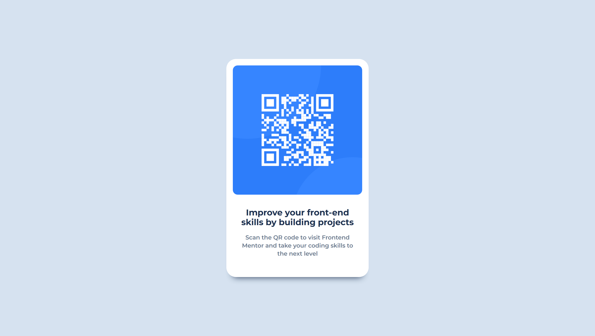

# Frontend Mentor - QR code component solution

This is a solution to the [QR code component challenge on Frontend Mentor](https://www.frontendmentor.io/challenges/qr-code-component-iux_sIO_H). Frontend Mentor challenges help you improve your coding skills by building realistic projects. 

## Table of contents

- [Overview](#overview)
  - [Screenshot](#screenshot)
  - [Links](#links)
- [My process](#my-process)
  - [Built with](#built-with)
  - [What I learned](#what-i-learned)
  - [Useful resources](#useful-resources)
- [Author](#author)

## Overview

### Screenshot



### Links

- Solution URL: [Click Me](https://www.frontendmentor.io/solutions/flexbox-CJ6VPrXLNr)
- Live Site URL: [Click Me](https://suchit-shah.github.io/frontend-mentor/newbie-level/qr-code-component/)

## My process

### Built with

- Semantic HTML5 markup
- CSS
- Flexbox

### What I learned

I was not able to centre-align the card, so i asked claude how to do it and then it explained me about flexbox.

I also came to know that we can use many more fonts which are not available with the HTML using Google Fonts.

I came to know a new method of defining color : hsl ()

I came to know < img > is an inline element

```css
box-shadow: 0 1rem 1rem -1rem hsl(218, 44%, 22%);
```

### Useful resources

- [MDN](https://developer.mozilla.org/en-US/) - This helped me for recalling syntax of css styling.

## Author

- Frontend Mentor - [@Suchit-Shah](https://www.frontendmentor.io/profile/Suchit-Shah)