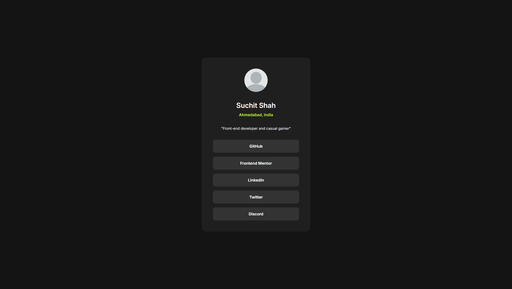

# Frontend Mentor - Social links profile solution

This is a solution to the [Social links profile challenge on Frontend Mentor](https://www.frontendmentor.io/challenges/social-links-profile-UG32l9m6dQ).

## Table of contents

- [Overview](#overview)
  - [The challenge](#the-challenge)
  - [Screenshot](#screenshot)
  - [Links](#links)
- [My process](#my-process)
  - [Built with](#built-with)
  - [What I learned](#what-i-learned)
  - [Useful resources](#useful-resources)
- [Author](#author)

## Overview

### The challenge

Users should be able to:

- See hover and focus states for all interactive elements on the page

### Screenshot



### Links

- Solution URL: [Click Me](https://your-solution-url.com)
- Live Site URL: [Click Me](https://your-live-site-url.com)

## My process

### Built with

- Semantic HTML5 markup
- CSS
- Flexbox

### What I learned

- Today i learnt about how html measures width :

  Total width = padding + element width + border

  But i had calculated total width including padding and border inside it, so to fix it, i used box-sizing : box-content

- I also learnt how to control overflow

```css
*{
    color: white;
    box-sizing: border-box;
    text-align: center;

    padding: 0;
    margin: 0;
}
```
```css
.pic{
    overflow: hidden;

    border-radius: 50%;

    width: 27%;
    aspect-ratio: 1/1;
}
```

### Useful resources

- [MDN](https://developer.mozilla.org/en-US/) - This helped me to understand how box-sizing works.

## Author

- Frontend Mentor - [@Suchit-Shah](https://www.frontendmentor.io/profile/Suchit-Shah)
- Twitter - [@Suchit_Shah_](https://x.com/Suchit_Shah_)