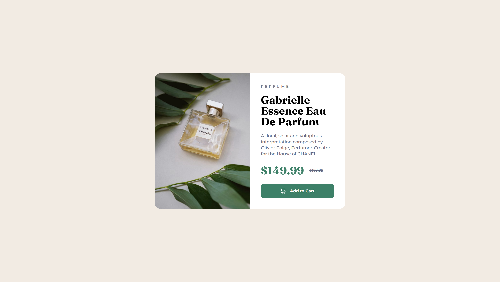

# Frontend Mentor - Product preview card component solution

This is a solution to the [Product preview card component challenge on Frontend Mentor](https://www.frontendmentor.io/challenges/product-preview-card-component-GO7UmttRfa).

## Table of contents

- [Overview](#overview)
  - [The challenge](#the-challenge)
  - [Screenshot](#screenshot)
  - [Links](#links)
- [My process](#my-process)
  - [Built with](#built-with)
  - [What I learned](#what-i-learned)
  - [Useful resources](#useful-resources)
- [Author](#author)

## Overview

### The challenge

Users should be able to:

- View the optimal layout depending on their device's screen size
- See hover and focus states for interactive elements

### Screenshot




### Links

- Solution URL: [Click Me](https://www.frontendmentor.io/solutions/product-preview-card-component-lzeOCF6IWl)
- Live Site URL: [Click Me](https://suchit-shah.github.io/frontend-mentor/newbie-level/005-product-preview-card-component/)

## My process

### Built with

- Semantic HTML5 markup
- CSS
- Flexbox

### What I learned

I learnt that we cannot update source link of image using media queries in css, we have to do the update in html file using <picture> element

```css
<div class="pic">
    <picture>
        <source media="(max-width: 37rem)" srcset="./images/image-product-mobile.jpg">
        
    /picture>
</div>
```

### Useful resources

- [MDN](https://developer.mozilla.org/en-US/) - Reading Docs

## Author

- Frontend Mentor - [@Suchit-Shah](https://www.frontendmentor.io/profile/Suchit-Shah)
- Twitter - [@Suchit_Shah_](https://x.com/Suchit_Shah_)