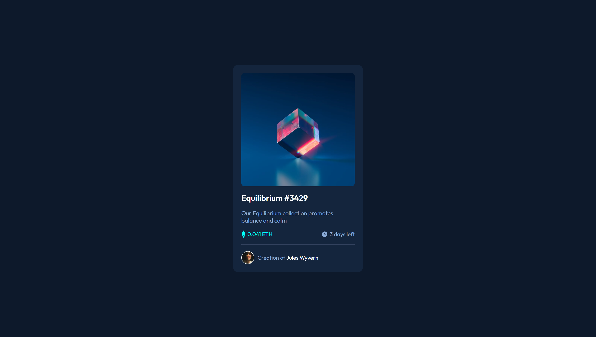
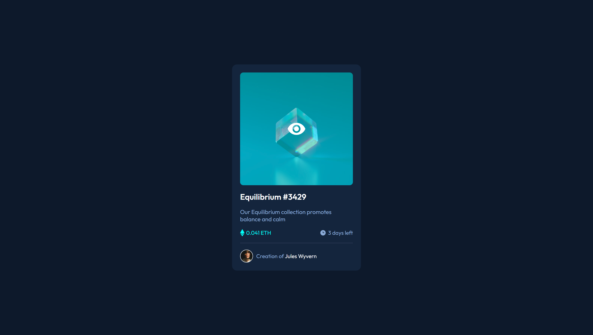

# Frontend Mentor - NFT preview card component solution

This is a solution to the [NFT preview card component challenge on Frontend Mentor](https://www.frontendmentor.io/challenges/nft-preview-card-component-SbdUL_w0U).

## Table of contents

- [Overview](#overview)
  - [The challenge](#the-challenge)
  - [Screenshot](#screenshot)
  - [Links](#links)
- [My process](#my-process)
  - [Built with](#built-with)
  - [What I learned](#what-i-learned)
  - [Useful resources](#useful-resources)
- [Author](#author)

## Overview

### The challenge

Users should be able to:

- View the optimal layout depending on their device's screen size
- See hover states for interactive elements

### Screenshot




### Links

- Solution URL: [Click Me](https://your-solution-url.com)
- Live Site URL: [Click Me](https://your-live-site-url.com)

## My process

### Built with

- Semantic HTML5 markup
- CSS
- Flexbox

### What I learned

In the beginning of the challenge, I considered it to be a very basic project. But it proved me wrong and taught me many things which i didn't knew about

- To style < hr > we have to style its border, and not background-color or color

- I learnt about position : parent has to be given a relative position and then we can position its children accordingly

- The thing which i enjoyed learning was how to set opacity of background 0.5 and opacity of image 1 at the same time upon hoverig

```css
hr{
    border: 0.05rem solid hsl(215, 32%, 27%);
}
```
```css
.img{
    position: relative;
    overflow: hidden;
    border-radius: 0.5rem;
}

#i1{
    width: 100%;
    aspect-ratio: 1/1;
}

.overlay{
    position: absolute;
    top: 0;
    left: 0;

    background-color: hsla(178, 100%, 50%, 0);

    width: 100%;
    height: 100%;

    display: flex;
    justify-content: center;
    align-items: center;
}

.img:hover .overlay{
    background-color: hsla(178, 100%, 50%, 0.5);
    cursor: pointer;
}

#i11{
    opacity: 0;
}

.img:hover #i11{
    opacity: 1;
}
```

### Useful resources

- [MDN](https://developer.mozilla.org/en-US/) - Documentation

## Author

- Frontend Mentor - [@Suchit-Shah](https://www.frontendmentor.io/profile/Suchit-Shah)
- Twitter - [@Suchit_Shah_](https://x.com/Suchit_Shah_)