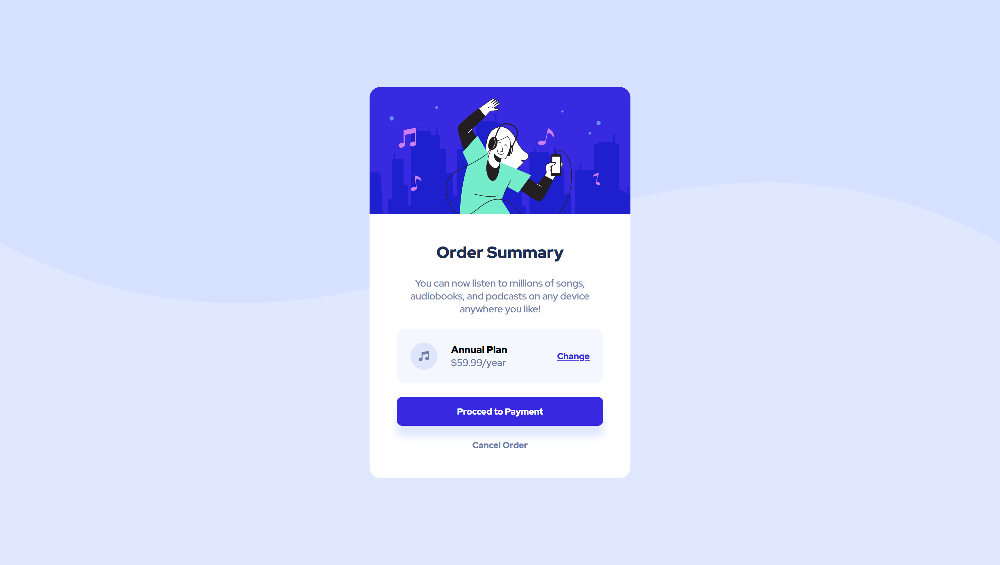

# Frontend Mentor - Order summary card solution

This is a solution to the [Order summary card challenge on Frontend Mentor](https://www.frontendmentor.io/challenges/order-summary-component-QlPmajDUj).

## Table of contents

- [Overview](#overview)
  - [The challenge](#the-challenge)
  - [Screenshot](#screenshot)
  - [Links](#links)
- [My process](#my-process)
  - [Built with](#built-with)
  - [What I learned](#what-i-learned)
  - [Useful resources](#useful-resources)
- [Author](#author)

### The challenge

Users should be able to:

- See hover states for interactive elements

### Screenshot



### Links

- Solution URL: [Click Me](https://your-solution-url.com)
- Live Site URL: [Click Me](https://your-live-site-url.com)

## My process

### Built with

- Semantic HTML5 markup
- CSS
- Flexbox

### What I learned

I learnt that we can have background-image and background-color at the same time

```css
body{
    display: flex;
    justify-content: center;
    align-items: center;

    background-color: hsl(225, 100%, 94%);
    background-image: url("./images/pattern-background-desktop.svg");
    background-size: contain;
    background-repeat: no-repeat;

    min-height: 100vh;
    min-width: 100vw;
}
```

### Useful resources

- [MDN](https://developer.mozilla.org/en-US/) - Documentation

## Author

- Frontend Mentor - [@Suchit-Shah](https://www.frontendmentor.io/profile/Suchit-Shah)
- Twitter - [@Suchit_Shah_](https://x.com/Suchit_Shah_)