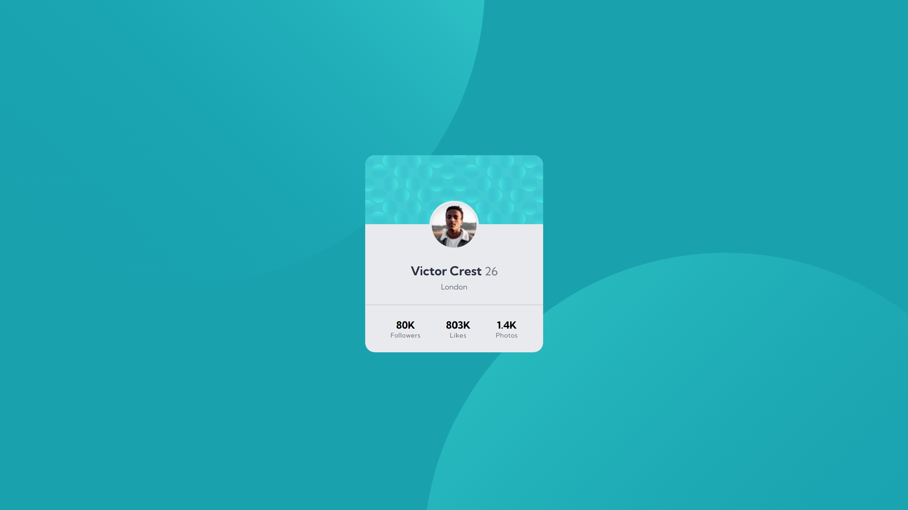

# Frontend Mentor - Profile card component solution

This is a solution to the [Profile card component challenge on Frontend Mentor](https://www.frontendmentor.io/challenges/profile-card-component-cfArpWshJ).

## Table of contents

- [Overview](#overview)
  - [The challenge](#the-challenge)
  - [Screenshot](#screenshot)
  - [Links](#links)
- [My process](#my-process)
  - [Built with](#built-with)
  - [What I learned](#what-i-learned)
  - [Useful resources](#useful-resources)
- [Author](#author)

## Overview

### The challenge

- Build out the project to the designs provided

### Screenshot



### Links

- Solution URL: [Click Me](https://www.frontendmentor.io/solutions/011-profile-card-component-Az5-iyWct8)
- Live Site URL: [Click Me](https://suchit-shah.github.io/frontend-mentor/newbie-level/011-profile-card-component/)

## My process

### Built with

- Semantic HTML5 markup
- CSS
- Flexbox

### What I learned

I learnt about negative positioning and z-index property

```css
#i1{
    top: -32rem;
    left: -12rem;
}
```
```css
#i1, #i2{
    position: absolute;
    z-index: 0;
}
```

### Useful resources

- [MDN](https://www.example.com) - Documentation

## Author

- Frontend Mentor - [@Suchit-Shah](https://www.frontendmentor.io/profile/Suchit-Shah)
- Twitter - [@Suchit_Shah_](https://x.com/Suchit_Shah_)