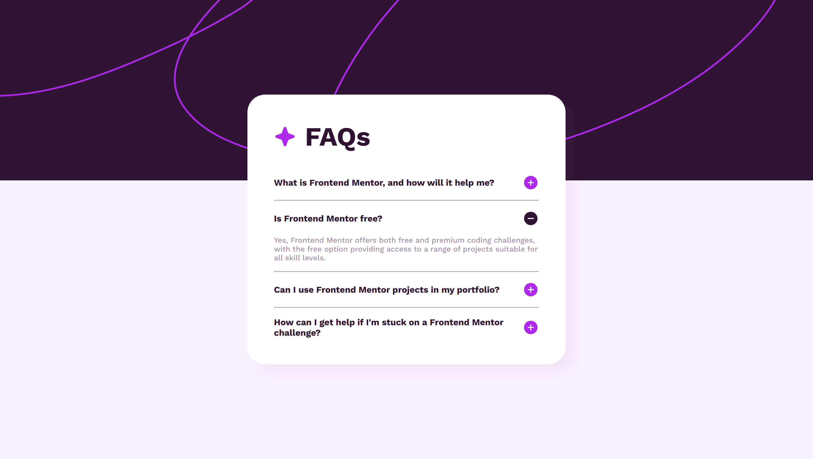

# Frontend Mentor - FAQ accordion solution

This is a solution to the [FAQ accordion challenge on Frontend Mentor](https://www.frontendmentor.io/challenges/faq-accordion-wyfFdeBwBz). 

## Table of contents

- [Overview](#overview)
  - [The challenge](#the-challenge)
  - [Screenshot](#screenshot)
  - [Links](#links)
- [My process](#my-process)
  - [What I learned](#what-i-learned)
  - [Useful resources](#useful-resources)
- [Author](#author)

## Overview

### The challenge

Users should be able to:

- Hide/Show the answer to a question when the question is clicked
- Navigate the questions and hide/show answers using keyboard navigation alone
- View the optimal layout for the interface depending on their device's screen size
- See hover and focus states for all interactive elements on the page

### Screenshot



### Links

- Solution URL: [Click Me](https://www.frontendmentor.io/solutions/016-faq-accordion-ZkDWzLHEk5)
- Live Site URL: [Click Me](https://suchit-shah.github.io/frontend-mentor/newbie-level/016-faq-accordion/)

## My process

### Built with

- Semantic HTML5 markup
- CSS
- Flexbox

### What I learned

I learnt how to select elements using js and also to add Event Listeners

```js
row = document.querySelectorAll('.r');
ans = document.querySelectorAll('.a');
icons = document.querySelectorAll('.r .icon img');

row.forEach((r, i) => {
    r.addEventListener('click', () => {
        a = ans[i];
        icon = icons[i];

        if(a.style.display == "block"){
            a.style.display = "none";
            icon.src = "./images/icon-plus.svg";
        }
        else{
            a.style.display = "block";
            icon.src = "./images/icon-minus.svg";
        }
    });
});
```

### Useful resources

- [MDN](https://developer.mozilla.org/en-US/) - Documentation

## Author

- Frontend Mentor - [@Suchit-Shah](https://www.frontendmentor.io/profile/Suchit-Shah)
- Twitter - [@Suchit_Shah_](https://x.com/Suchit_Shah_)