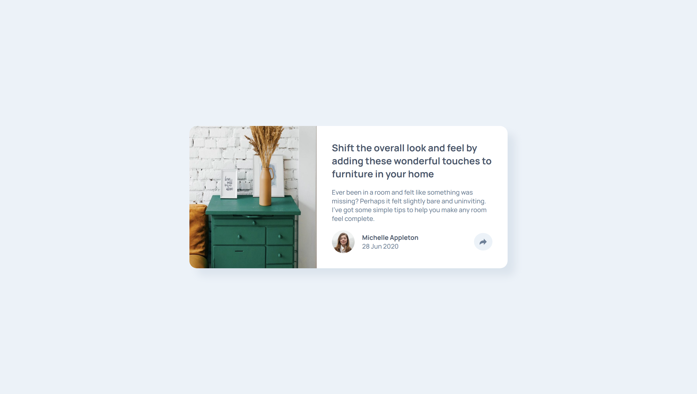

# Frontend Mentor - Article preview component solution

This is a solution to the [Article preview component challenge on Frontend Mentor](https://www.frontendmentor.io/challenges/article-preview-component-dYBN_pYFT). 

## Table of contents

- [Overview](#overview)
  - [The challenge](#the-challenge)
  - [Screenshot](#screenshot)
  - [Links](#links)
- [My process](#my-process)
  - [Built with](#built-with)
  - [What I learned](#what-i-learned)
  - [Useful resources](#useful-resources)
- [Author](#author)

## Overview

### The challenge

Users should be able to:

- View the optimal layout for the component depending on their device's screen size
- See the social media share links when they click the share icon

### Screenshot



### Links

- Solution URL: [Click Me](https://www.frontendmentor.io/solutions/017-article-preview-component-v1S4EHcCW7)
- Live Site URL: [Click Me](https://suchit-shah.github.io/frontend-mentor/newbie-level/017-article-preview-component/)

## My process

### Built with

- Semantic HTML5 markup
- CSS
- Flexbox

### What I learned

I learnt about positioning an element wrt another element using position and transform

```css
position: absolute;
bottom: calc(100% + 1.5rem);
right: 50%; 
/* wrt to its parent */
/* right edge of popup is in centre(leave 50% width of share) */
/* to bring the centre alignment */
/* -------
        --- */
transform: translateX(50%);
/* applicable to its own width */
/* -------
     ---   */
```

### Useful resources

- [MDN](https://developer.mozilla.org/en-US/) - Documentation

## Author

- Frontend Mentor - [@Suchit-Shah](https://www.frontendmentor.io/profile/Suchit-Shah)
- Twitter - [@Suchit_Shah_](https://www.twitter.com/Suchit_Shah_)